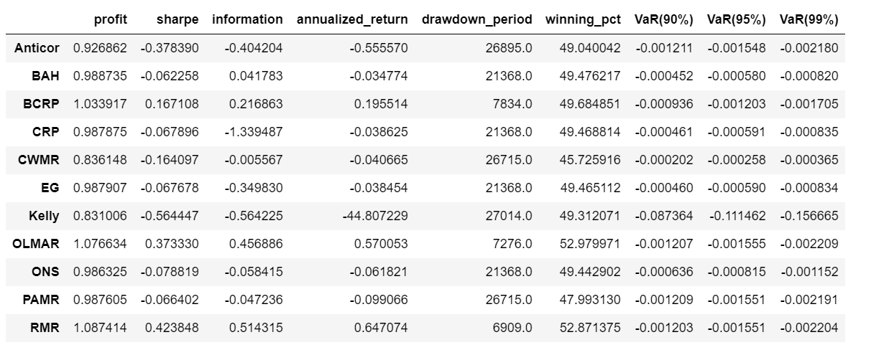

# ECO301

Portfolio Management with Futures Contract

## Usage

1. Install dependencies

```
# virtualenv is recommended
# or conda
# > conda create -n testenv python=3.6
# > conda activate testenv
pip install -r requirements.txt
```

2. Run the sample notebook

```
# If using conda
# > source activate testenv
# > python -m ipykernel install --user --name testenv --display-name "Python (testenv)"
# and double check with
# > which jupyter
jupyter notebook
```

3. Result




## Data

* [0.csv](data/0.csv): Coking Coal
* [1.csv](data/1.csv): Palm Oil
* [2.csv](data/2.csv): Iron Ore
* [3.csv](data/3.csv): Soybean Oil
* [4.csv](data/4.csv): Corn
* [5.csv](data/5.csv): Polypropylene
* [6.csv](data/6.csv): Soybean Meal
* [7.csv](data/7.csv): Ethylene Glycol
* [8.csv](data/8.csv): Plastic
* [9.csv](data/9.csv): Coke
